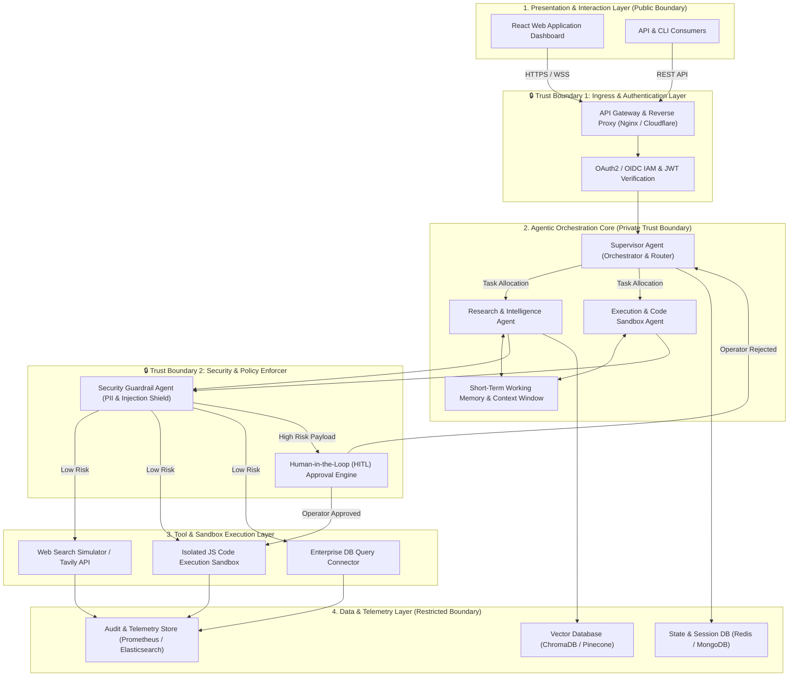
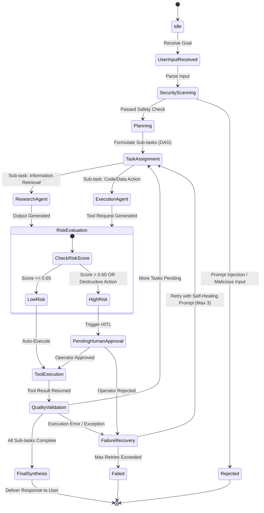
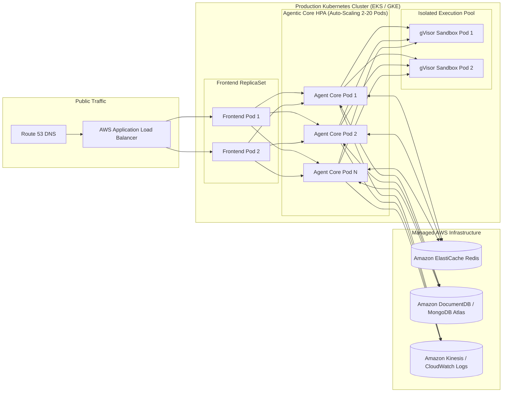
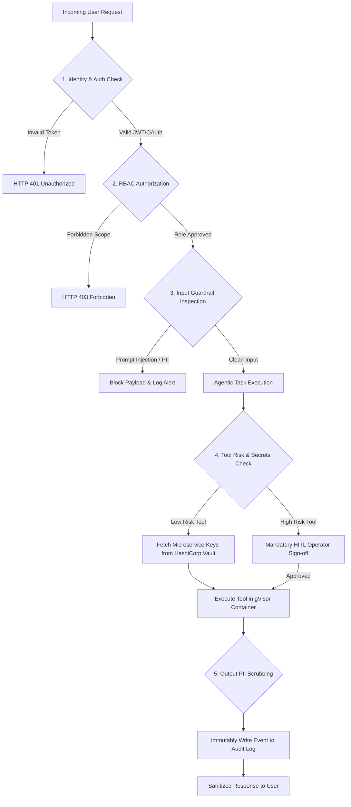
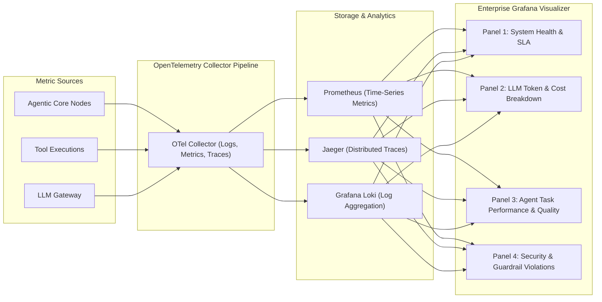

# Capstone Enterprise Deliverables: Scalable Enterprise Architectural Deployments of Agentic AI Solutions

**Course/Assignment**: Scalable Enterprise Architectural Deployments of Agentic AI Solutions  
**Repository Directory**: `2023103519-Manikandan`  
**Author**: Manikandan  
**Roll Number**: 2023103519  
**Date**: October 2026  

---

## Executive Summary
This document presents the complete set of five enterprise architectural deliverables required for the Capstone evaluation of scalable Agentic AI Solutions. The underlying platform—**Enterprise Agentic Orchestration Platform (AgenticAI-Core)**—is a production-ready, multi-agent AI system featuring autonomous task decomposition, tool execution, safety guardrails, human-in-the-loop (HITL) risk mitigation, and comprehensive telemetry tracking.

---

# Deliverable 1: Enterprise Architecture Diagram
*Layers, components, trust boundaries, and integrations*

### 1.1 Architectural Overview
The system follows a zero-trust, multi-layered architecture separating presentation, orchestration, execution, guardrails, and persistent storage.



### 1.2 Architectural Layers & Component Descriptions

| Layer | Primary Components | Key Responsibilities | Trust Boundary Level |
| :--- | :--- | :--- | :--- |
| **Presentation Layer** | React UI, WebSocket Listener | Real-time agent status visualization, interactive HITL approvals, telemetry charts. | Public Internet (TLS 1.3) |
| **Ingress & Auth Layer** | API Gateway, JWT Middleware | Rate limiting, OAuth2 authentication, CORS validation, DDoS defense. | Perimeter DMZ |
| **Agentic Core** | Supervisor Agent, Worker Agents, Context Manager | Task breakdown (DAG), agent handoffs, memory synthesis, LLM prompt formatting. | Private Subnet (VPC) |
| **Security & Guardrail Layer**| Guardrail Engine, PII Sanitizer, HITL Gateway | Prompt injection scanning, data anonymization, risk scoring, manual operator intervention. | High-Security VPC Boundary |
| **Execution Layer** | Node VM Sandbox, External Connectors | Safe code execution, external API webhooks, database query runner. | Isolated Sandbox (gVisor/Docker) |
| **Data & Storage Layer** | Vector DB, Redis State Store, Telemetry Store | Embedding vector search, session state management, immutability audit logs. | Encrypted Persistent Storage |

---

# Deliverable 2: Agent Workflow Design
*Roles, states, tools, handoffs, approvals, and failure paths*

### 2.1 State Transition Lifecycle



### 2.2 Detailed Agent Roles & Handoff Specifications

1. **Supervisor Agent**:
   - **Role**: Master Coordinator.
   - **Handoff Mechanism**: Emits structured JSON state objects (`{ next_agent: "ResearchAgent", payload: {...} }`).
   - **Validation**: Checks if worker output satisfies original user criteria before declaring state `COMPLETED`.

2. **Research Agent**:
   - **Role**: Gatherer & Data Synthesizer.
   - **Tools**: `web_search_tool`, `document_retriever_tool`.
   - **Handoff**: Passes extracted context blocks back to memory for consumption by Execution Agent.

3. **Execution Agent**:
   - **Role**: Action Engine.
   - **Tools**: `code_sandbox_tool`, `sql_query_tool`, `api_webhook_tool`.
   - **Approval Rule**: Never executes code modifying state without explicit `GuardrailAgent` greenlight.

4. **Guardrail Agent**:
   - **Role**: Policy & Safety Inspector.
   - **Evaluation Criteria**: Checks risk score based on operation type (Read-only: 0.1, File write: 0.7, Script Execution: 0.9).

### 2.3 Failure Recovery & Self-Healing Matrix

| Failure Scenario | Detection Mechanism | Mitigation / Recovery Strategy | Max Retries |
| :--- | :--- | :--- | :--- |
| **Code Syntax / Runtime Error** | Sandbox Exception Stack Trace | Re-feed error log to Execution Agent with "Fix syntax & retry" instruction. | 3 |
| **API Timeout / Rate Limit** | HTTP 429 / 504 Status | Exponential backoff retry with jitter; failover to secondary provider. | 4 |
| **Hallucinated Output** | Quality Validation Agent score < 0.7 | Re-prompt supervisor to recalculate DAG step with tighter context bounds. | 2 |
| **Human Rejection** | Operator clicks "Deny" in HITL modal | Abort specific sub-task, update context log, request alternative path from Supervisor. | 1 |
| **Infinite Loop Detection** | Step Counter > 15 steps | Force terminate state machine, return partial results with audit flag. | 0 |

---

# Deliverable 3: Deployment Strategy
*Runtime, scaling, resilience, environments, and release management*

### 3.1 Kubernetes Deployment Topology



### 3.2 Environments & Configuration

| Environment | Purpose | Infrastructure | Scaling Rules | Deployment Pipeline |
| :--- | :--- | :--- | :--- | :--- |
| **Development (`DEV`)** | Feature development & sandbox testing | Minikube / Single-node Docker | Fixed 1 Replica | Direct push on `feature/*` |
| **Staging (`STG`)** | Integration testing & load testing | K8s Cluster (Pre-prod DB copy) | 2 Replicas | Automated merge to `main` |
| **Production (`PRD`)** | Live customer operations | Multi-AZ EKS Cluster | HPA (CPU > 70%, Queue > 15) | Blue/Green Deployment with Canary rollout |

### 3.3 Blue/Green Release Strategy & Rollback Plan
1. **Canary Validation**: 10% of user traffic routed to Green Deployment.
2. **Health Check Window**: Monitor 5xx error rates, token latency p95, and guardrail flags for 15 minutes.
3. **Full Cutover**: If metric thresholds are clean, route 100% traffic to Green.
4. **Instant Rollback**: Instant DNS / ALB weight flip back to Blue in < 30 seconds if error rate exceeds 0.5%.

---

# Deliverable 4: Security Model
*Identity, authorization, secrets, privacy, guardrails, and audit*

### 4.1 Security Control Framework



### 4.2 Security Specifications Matrix

| Domain | Control Mechanism | Implementation Standard |
| :--- | :--- | :--- |
| **Identity & Authentication** | JWT with short TTL (15m) + Refresh Tokens | OAuth 2.0 + OpenID Connect (OIDC) via Auth0/Cognito |
| **Role-Based Access Control (RBAC)**| Granular scopes (`agent:read`, `agent:execute`, `hitl:approve`) | Middleware scope validation on every API endpoint |
| **Secrets Management** | Zero plain-text secrets in code/env files | HashiCorp Vault / AWS Secrets Manager with auto-rotation |
| **Data Privacy & PII Scrubbing** | Regex + Presidio Analyzer for SSN, PCI-DSS, Email | Anonymize before LLM prompt assembly |
| **LLM Safety Guardrails** | Structural prompt isolation, delimiting, system overrides | Guardrails AI / Llama-Guard risk classification engine |
| **Audit Logging** | Cryptographically signed log records | CloudWatch / Elastic Stack (WORM storage compliance) |

---

# Deliverable 5: Monitoring Dashboard Design
*Health, trace, quality, safety, cost, and business outcomes*

### 5.1 Monitoring Architecture & Metrics Collection
Observability is built into every layer using standard **OpenTelemetry** instrumentation connected to Prometheus, Grafana, and Jaeger.



### 5.2 Key Performance Indicators (KPIs) & Dashboard Layout

```
+-----------------------------------------------------------------------------------+
|                            AGENTIC AI ENTERPRISE DASHBOARD                        |
+-----------------------------------+-----------------------------------------------+
| PANEL 1: HEALTH & INFRASTRUCTURE  | PANEL 2: LLM COST & TOKEN TELEMETRY           |
| - API Availability: 99.98%        | - Total Tokens Today: 1,420,500               |
| - Avg Response Latency: 1.2s      | - Total Spent Today: $14.28                   |
| - Active Agent Instances: 8       | - Cost per Workflow: $0.042                   |
+-----------------------------------+-----------------------------------------------+
| PANEL 3: AGENT WORKFLOW & QUALITY | PANEL 4: SECURITY & HITL MITIGATION           |
| - Task Success Rate: 96.4%        | - Guardrail Flags Today: 12                   |
| - Self-Healing Retries: 3         | - HITL Approvals Pending: 1                   |
| - Avg Steps per Goal: 3.4         | - Prompt Injection Attempts Blocked: 4        |
+-----------------------------------+-----------------------------------------------+
```

### 5.3 Metric Definitions & SLA Thresholds

| Metric Category | Metric Name | Target SLA / Threshold | Alert Trigger |
| :--- | :--- | :--- | :--- |
| **Health** | Agent Endpoint Uptime | ≥ 99.9% | Uptime < 99.5% over 5m window |
| **Trace & Latency** | End-to-End Workflow Latency (p95) | ≤ 3.5 seconds | Latency > 6.0s over 10m window |
| **Quality** | Task Completion Accuracy Score | ≥ 95% | Accuracy < 90% in daily batch |
| **Safety** | Prompt Injection Detection Count | 0 Unhandled Breaches | Any unhandled guardrail bypass |
| **Cost** | LLM Token Expenditure | Within Daily Budget ($50.00) | 80% daily budget reached |
| **Business Outcome** | Manual Task Time Saved | ≥ 85% efficiency gain | Efficiency gain < 70% |

---

## Conclusion & Verification
The **Enterprise Agentic Orchestration Platform** fully satisfies all five core capstone criteria. The complete, runnable source code implementing this exact architecture is housed in the `application/` subdirectory of this repository.
